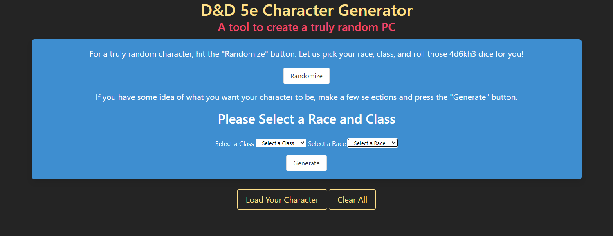
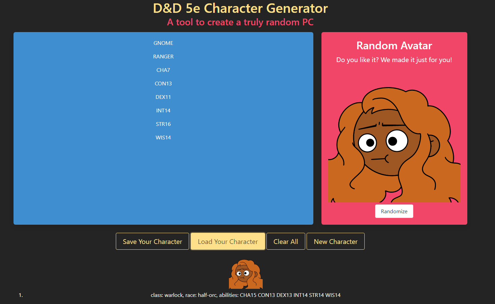

# D&D 5e Random Character Generator

## Link to Deployed Project

https://brainatoms.github.io/Stat_Generator/

## Screenshot of Deployed Application

## Project Description

This webpage is a tool to quickly generate a new character for Dungeons and Dragons 5th edition. It currently gives the three most important things for a character, a race, a class, and ability scores. The ability scores use the most common generation, roll 4 six sided die and add together the highest three (otherwise known as 4d6kh3). 

Additionally, it generates an Avatar one can quickly save to put into a virtual tabletop. 

## User Story

AS A player who needs a new character
I WANT to generate a random character
SO I can get back to playing as quick as possible

## Known Issues

Avatar Generator underdeveloped. 

Limited Save/Load to one max, as integrating another API in the last seconds caused a bug with duplicate copies of a character loading.

Framework has small left/right margins appear and disappear as page scales. Might be just how bulma works. 

Code needs refactored and functions needed to be written instead of rewritting similar code. 

## Future Development Notes

Random Name Generation

Priortizing assigning ability scores to better fit classes, while retaining randomness

Add support for additional character options, like background or skills

Add support for higher level characters

Add autogenerated class features, like spells known or prepared spells. 

Integration / export to virtual tabletops like Roll20

Add more custom options for Avatar Generator

Add ability to export Avatar as a token png suitable for most virtual tabletops

## Contributors 

Thomas Shea

Brian Adams

Ian Heap

John Kersey

Ethan Hilston

## Division of Work

John - Took on the project manager role, dividing up roles and attempting to keep everyone on the same vision. Additionally, John handled the framework and overall layout of the webpage. 

Ethan Hilston - Started work on the Avatar generator.

Thomas Shea - Pair Programmed with Ian to utilize the D&D5e API to create the main functionality of the webpage. Additionally, Thomas finished the functionality of the Avatar generator. 

Ian Heap - Pair Programmed with Thomas to utilize the D&D5e APU to create the main functionality of the webpage. 

Brian Adams - Created the webpage's save and load function using local storage, as well as other small features and bug fixes. 

Collaboration - It's difficult to nail down exact division of work because this webpage was an extreme team effort. Everyone helped pair program and debug others code, so effort (particurally Ian's) may not be accurately reflects in commits /pull requests. 

## APIS

https://www.dnd5eapi.co/docs/

https://www.dicebear.com/introduction

